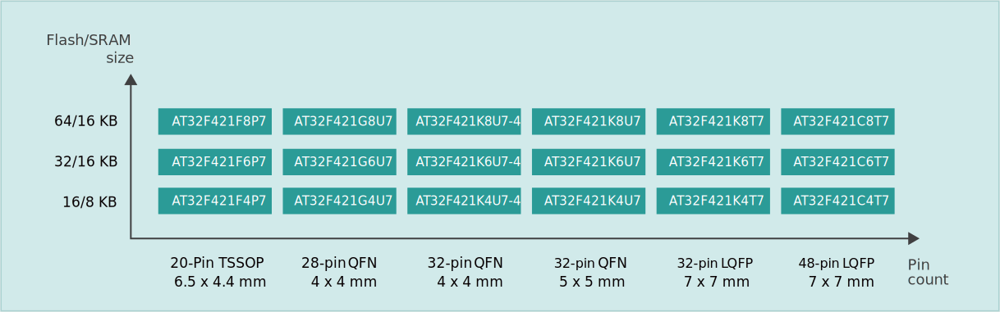
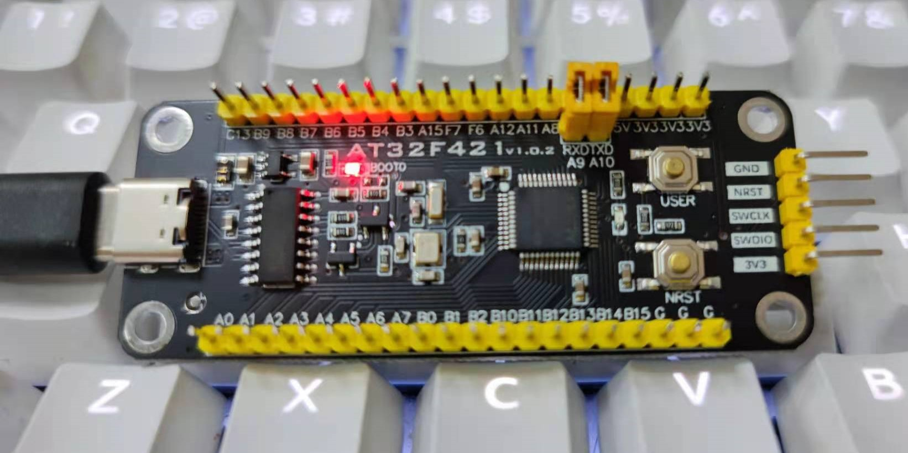

# [AT32F421](https://github.com/SoCXin/AT32F421)

* [arterytek](https://www.arterytek.com/cn/index.jsp): [Cortex-M4](https://github.com/SoCXin/Cortex)
* [L4R3](https://github.com/SoCXin/Level): 120 MHz x 1.25 DMIPS/MHz

## [简介](https://github.com/SoCXin/AT32F421/wiki)

[AT32F421](https://github.com/SoCXin/AT32F421) 超值型ARM® Cortex®-M4微控制器，高达120MHz的CPU运算速度与内建数字信号处理器(DSP)，最高可支持64KB闪存存储器(Flash)及16KB随机存取存储器(SRAM)，片上还集成了多达2个USART、2个SPI(可复用I²S)、2个I²C、1个16位高级定时器、5个16位通用定时器，和5通道DMA控制器。 同时还扩展了1个高速轨到轨输入/输出模拟电压比较器，1个采样率高达2M SPS的12位15通道高速ADC，可充分满足高速数据采集、混合信号处理和工业控制与电机应用要求。 几乎所有I/O口可容忍5V输入信号，且所有I/O口均为快速I/O，具有多种可选功能还支持端口重映射，极佳的灵活性和易用性满足多种应用需求。

### 关键特性

* Cortex®-M4主频最高120MHz
* sLib执行代码安全库区
* 工业级温度范围-40~105°C
* STM32F030管脚兼容

### [资源收录](https://github.com/SoCXin/AT32F421)

* [参考资源](src/)
* [参考文档](docs/)
* [参考工程](project/)

### [选型建议](https://github.com/SoCXin)

[AT32F421](https://github.com/SoCXin/AT32F421) 系列搭载了雅特力自行开发的sLib安全库 (Security Library) ，可支持密码保护指定范围程序区，方案商烧录核心算法到此区域，提供给下游客户做二次开发，强化了产品本身的安全性、可靠性和二次开发的使用便利度。

该系列定位超值型，主要替代F030 F103 E230 F330等型号，官方提供移植步骤

#### 封装规格

* LQFP48 7 x 7 mm
* LQFP32 7 x 7 mm
* QFN32 5 x 5 mm
* QFN32 4 x 4 mm
* QFN28 4 x 4 mm
* TSSOP20 6.5 x 4.4 mm

#### 相关开发板

### [探索芯世界 www.SoC.xin](http://www.SoC.Xin)
