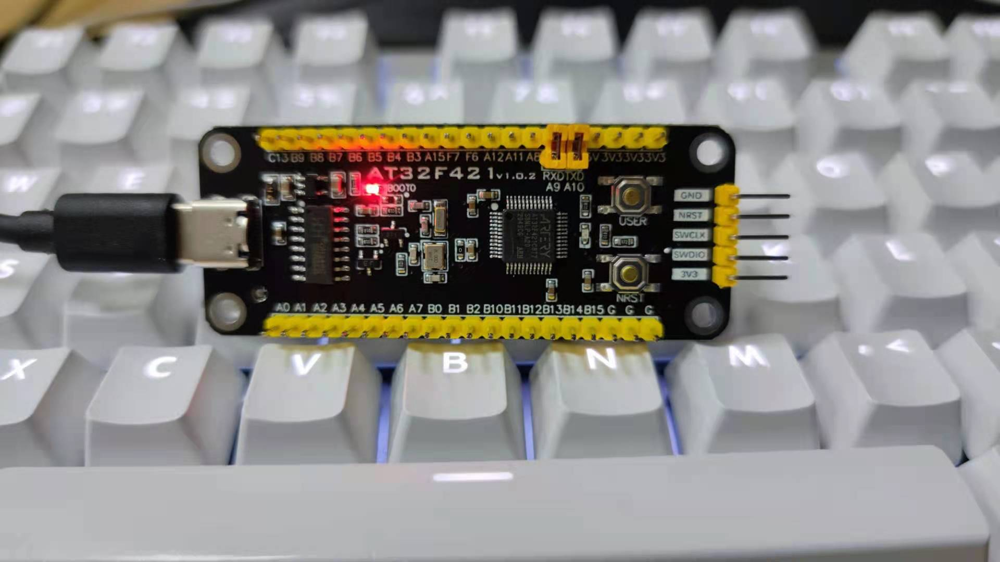

# [AT32F421](https://www.soc.xin/AT32F421)

* [arterytek](https://www.arterytek.com/cn/index.jsp): [Cortex-M4F](https://github.com/SoCXin/Cortex)
* [L2R2](https://github.com/SoCXin/Level): 120 MHz , [￥4.69 (LQFP48)](https://item.szlcsc.com/2791152.html)

## [简介](https://github.com/SoCXin/AT32F421/wiki)

[AT32F421](https://www.arterytek.com/cn/product/AT32F421.jsp) 超值型ARM® Cortex®-M4微控制器，高达120MHz的CPU运算速度与内建数字信号处理器(DSP)，最高可支持64KB闪存存储器(Flash)及16KB随机存取存储器(SRAM)，片上还集成了多达2个USART、2个SPI(可复用I²S)、2个I²C、1个16位高级定时器、5个16位通用定时器，和5通道DMA控制器。

同时还扩展了1个高速轨到轨输入/输出模拟电压比较器，1个采样率高达2M SPS的12位15通道高速ADC，可充分满足高速数据采集、混合信号处理和工业控制与电机应用要求。 几乎所有I/O口可容忍5V输入信号，且所有I/O口均为快速I/O，具有多种可选功能还支持端口重映射，极佳的灵活性和易用性满足多种应用需求。

### 关键参数

* 120 MHz Cortex-M4F
* 16KB SRAM + 64KB Flash
* 15ch 12-bit ADC (2MSPS)
* 2 x USART
* 2 x I2C + 2 x SPI/I2S
* ERTC (1ppm的分辨率)
* COMP (轨到轨比较器,1/4、1/2、3/4 VREF)
* sLib安全库 (Security Library)
* 封装规格：
    *  LQFP48 7 x 7 mm
    *  LQFP32 7 x 7 mm
    *  QFN32 5 x 5 mm
    *  QFN32 4 x 4 mm
    *  QFN28 4 x 4 mm
    *  TSSOP20 6.5 x 4.4 mm

## [资源收录](https://github.com/SoCXin)

* [参考资源](src/)
* [参考文档](docs/)
* [工程模板](templates/)

## [选型建议](https://github.com/SoCXin)

目前的价格段性价比优势不大，相似规格性能更好可以考虑[N32G430](https://github.com/SoCXin/N32G430)

[AT32F421](https://github.com/SoCXin/AT32F421) 系列搭载了雅特力自行开发的sLib安全库 (Security Library) ，可支持密码保护指定范围程序区，方案商烧录核心算法到此区域，提供给下游客户做二次开发，强化了产品本身的安全性、可靠性和二次开发的使用便利度。

#### 相关开发板

